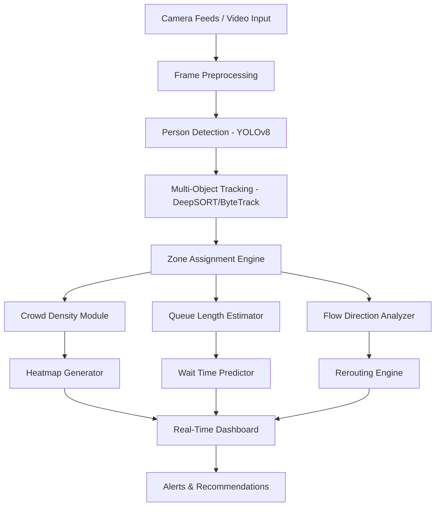

# 🏟️ Crowd Movement & Queue Intelligence Model — Implementation Guide

## Overview

This guide walks you through implementing a real-time crowd detection and queue intelligence system for large-scale sporting venues. The system uses **computer vision + object detection + multi-object tracking + real-time analytics**.

---

## 🧱 System Architecture



---

## 📋 Step-by-Step Implementation

---

### ✅ STEP 1 — Define Venue Zones & Camera Placement

**Goal**: Map all key locations where crowd data needs to be collected.

#### Zones to Monitor:
| Zone | Type | Priority |
|---|---|---|
| Main Entry Gates (A, B, C) | Entry | 🔴 Critical |
| Exit Gates | Exit | 🔴 Critical |
| Food Stalls (F1–F5) | Queue | 🟠 High |
| Washrooms | Queue | 🟠 High |
| Transport / Parking Zone | Flow | 🟡 Medium |
| Seating Concourse | Density | 🟡 Medium |

#### Actions:
- Draw a **venue floor plan** (use image or SVG)
- Mark **zone polygons** for each area using coordinates (x, y points)
- Decide **camera angles** — overhead (bird's eye) or angled
- Assign each camera a zone ID

> 💡 **Tip**: Overhead/top-down cameras give the best detection accuracy for crowd density.

---

### ✅ STEP 2 — Tech Stack Selection

#### Core Stack:
```
Language:        Python 3.10+
Detection:       YOLOv8 (Ultralytics) — best accuracy/speed tradeoff
Tracking:        ByteTrack or DeepSORT
Video Input:     OpenCV (cv2)
Zone Logic:      Shapely (polygon containment)
Heatmap:         OpenCV + SciPy / Seaborn
Backend API:     FastAPI (WebSocket for real-time streaming)
Dashboard:       React.js + Chart.js / D3.js / Leaflet.js
Database:        Redis (real-time state) + PostgreSQL (historical)
Deployment:      Docker + optional GPU (CUDA)
```

#### Install Core Libraries:
```bash
pip install ultralytics opencv-python shapely fastapi uvicorn
pip install scipy numpy pandas redis psycopg2-binary
pip install websockets python-multipart
```

---

### ✅ STEP 3 — Person Detection Pipeline

**Goal**: Detect every person in every camera frame.

#### Implementation:
```python
# detection_engine.py
from ultralytics import YOLO
import cv2

class CrowdDetector:
    def __init__(self, model_path="yolov8n.pt", confidence=0.4):
        self.model = YOLO(model_path)
        self.conf = confidence

    def detect(self, frame):
        results = self.model(frame, classes=[0], conf=self.conf)  # class 0 = person
        detections = []
        for r in results:
            for box in r.boxes:
                x1, y1, x2, y2 = map(int, box.xyxy[0])
                conf = float(box.conf[0])
                cx, cy = (x1 + x2) // 2, (y1 + y2) // 2  # centroid
                detections.append({
                    "bbox": [x1, y1, x2, y2],
                    "confidence": conf,
                    "centroid": (cx, cy)
                })
        return detections
```

#### Model Choices:
| Model | Speed | Accuracy | Use Case |
|---|---|---|---|
| `yolov8n.pt` | ⚡ Fastest | Good | CPU / Edge devices |
| `yolov8s.pt` | Fast | Better | Balanced |
| `yolov8m.pt` | Medium | Best | GPU server |

---

### ✅ STEP 4 — Multi-Object Tracking (MOT)

**Goal**: Give each person a unique persistent ID across frames to track movement.

#### Using ByteTrack (recommended for crowds):
```bash
pip install supervision  # includes ByteTrack wrapper
```

```python
# tracker.py
import supervision as sv

class CrowdTracker:
    def __init__(self):
        self.tracker = sv.ByteTrack()

    def update(self, detections_sv):
        # detections_sv: supervision.Detections object
        tracked = self.tracker.update_with_detections(detections_sv)
        return tracked  # includes tracker_id per person
```

#### What Tracking Gives You:
- **Unique ID** per person (e.g., Person #42)
- **Trajectory** — path taken through the venue
- **Dwell time** — how long someone stays in a zone
- **Entry/Exit timestamps** per zone

---

### ✅ STEP 5 — Zone Assignment Engine

**Goal**: For each detected person, determine which venue zone they are currently in.

#### Using Shapely for polygon zones:
```python
# zone_engine.py
from shapely.geometry import Point, Polygon

# Define zones as polygons using pixel coordinates from camera view
ZONES = {
    "entry_gate_A": Polygon([(100, 50), (300, 50), (300, 200), (100, 200)]),
    "food_stall_F1": Polygon([(400, 300), (600, 300), (600, 450), (400, 450)]),
    "washroom_W1":   Polygon([(700, 100), (900, 100), (900, 250), (700, 250)]),
    "exit_gate":     Polygon([(50, 500), (250, 500), (250, 620), (50, 620)]),
}

def assign_zone(centroid_x, centroid_y):
    point = Point(centroid_x, centroid_y)
    for zone_name, polygon in ZONES.items():
        if polygon.contains(point):
            return zone_name
    return "general_concourse"
```

---

### ✅ STEP 6 — Crowd Density Monitoring

**Goal**: Count people in each zone and classify density level.

```python
# density_monitor.py
DENSITY_THRESHOLDS = {
    "entry_gate_A":  {"low": 10, "medium": 25, "high": 50},
    "food_stall_F1": {"low": 5,  "medium": 15, "high": 30},
    "washroom_W1":   {"low": 3,  "medium": 8,  "high": 15},
}

def get_density_level(zone_name, count):
    thresholds = DENSITY_THRESHOLDS.get(zone_name, {"low": 10, "medium": 20, "high": 40})
    if count <= thresholds["low"]:
        return "LOW", "🟢"
    elif count <= thresholds["medium"]:
        return "MEDIUM", "🟡"
    else:
        return "HIGH", "🔴"

def compute_density_per_zone(tracked_people):
    zone_counts = {}
    for person in tracked_people:
        zone = person["zone"]
        zone_counts[zone] = zone_counts.get(zone, 0) + 1
    return zone_counts
```

---

### ✅ STEP 7 — Queue Length & Wait Time Estimation

**Goal**: Estimate how many people are in a queue and predict waiting time.

#### Queue Detection Strategy:
```python
# queue_estimator.py

# Queue zones are rectangular strips in front of service points
QUEUE_ZONES = {
    "food_stall_F1_queue": {
        "polygon": Polygon([...]),
        "service_rate": 2.5,   # people served per minute
        "num_counters": 2
    }
}

def estimate_wait_time(queue_name, queue_count):
    zone = QUEUE_ZONES[queue_name]
    service_rate = zone["service_rate"] * zone["num_counters"]
    wait_minutes = queue_count / service_rate
    return round(wait_minutes, 1)

def get_queue_stats(zone_name, zone_counts):
    count = zone_counts.get(zone_name, 0)
    wait = estimate_wait_time(zone_name, count)
    return {
        "zone": zone_name,
        "queue_length": count,
        "estimated_wait_min": wait
    }
```

---

### ✅ STEP 8 — Heatmap Generation

**Goal**: Visualize crowd density as a live color overlay on the venue map.

```python
# heatmap_generator.py
import numpy as np
import cv2
from scipy.ndimage import gaussian_filter

def generate_heatmap(frame_shape, centroids, sigma=20):
    h, w = frame_shape[:2]
    heatmap = np.zeros((h, w), dtype=np.float32)

    for (cx, cy) in centroids:
        if 0 <= cx < w and 0 <= cy < h:
            heatmap[cy, cx] += 1

    # Smooth the heatmap
    heatmap = gaussian_filter(heatmap, sigma=sigma)

    # Normalize to 0–255
    if heatmap.max() > 0:
        heatmap = (heatmap / heatmap.max() * 255).astype(np.uint8)

    # Apply colormap (COLORMAP_JET: blue=low, red=high)
    colored = cv2.applyColorMap(heatmap, cv2.COLORMAP_JET)

    # Overlay on original frame
    overlay = cv2.addWeighted(frame, 0.6, colored, 0.4, 0)
    return overlay
```

---

### ✅ STEP 9 — Flow Direction Analysis

**Goal**: Detect crowd movement direction at entry/exit points.

```python
# flow_analyzer.py
from collections import defaultdict

# Store last N positions per person
person_history = defaultdict(list)
HISTORY_LEN = 10

def update_trajectory(person_id, centroid):
    person_history[person_id].append(centroid)
    if len(person_history[person_id]) > HISTORY_LEN:
        person_history[person_id].pop(0)

def get_flow_direction(person_id):
    history = person_history[person_id]
    if len(history) < 2:
        return "stationary"
    dx = history[-1][0] - history[0][0]
    dy = history[-1][1] - history[0][1]
    if abs(dx) > abs(dy):
        return "→ right" if dx > 0 else "← left"
    else:
        return "↓ down" if dy > 0 else "↑ up"

def count_entry_exit(zone_name, person_id, current_zone, previous_zones):
    # Entry: person newly enters a gate zone
    # Exit: person leaves a gate zone
    prev = previous_zones.get(person_id)
    if current_zone == zone_name and prev != zone_name:
        return "ENTRY"
    elif prev == zone_name and current_zone != zone_name:
        return "EXIT"
    return None
```

---

### ✅ STEP 10 — Smart Rerouting Recommendations

**Goal**: When a zone is congested, suggest alternatives to attendees and operators.

```python
# rerouting_engine.py

ALTERNATIVES = {
    "food_stall_F1": ["food_stall_F3", "food_stall_F5"],
    "entry_gate_A":  ["entry_gate_B", "entry_gate_C"],
    "washroom_W1":   ["washroom_W2", "washroom_W3"],
}

def generate_recommendations(zone_density_map):
    recommendations = []
    for zone, (level, icon) in zone_density_map.items():
        if level == "HIGH":
            alts = ALTERNATIVES.get(zone, [])
            alt_levels = {a: zone_density_map.get(a, ("UNKNOWN", "⚪")) for a in alts}
            best_alt = min(alt_levels, key=lambda a: ["LOW", "MEDIUM", "HIGH", "UNKNOWN"].index(alt_levels[a][0]), default=None)
            recommendations.append({
                "congested_zone": zone,
                "recommendation": f"Redirect attendees to {best_alt}" if best_alt else "Open additional counters",
                "severity": icon
            })
    return recommendations
```

---

### ✅ STEP 11 — Backend API (FastAPI + WebSocket)

**Goal**: Stream real-time data to the dashboard.

```python
# main.py
from fastapi import FastAPI, WebSocket
import asyncio, json

app = FastAPI()

@app.websocket("/ws/crowd-data")
async def crowd_websocket(websocket: WebSocket):
    await websocket.accept()
    while True:
        # Fetch latest processed data
        data = {
            "timestamp": get_timestamp(),
            "zones": get_zone_density_data(),
            "queues": get_queue_stats_all(),
            "recommendations": get_active_recommendations(),
            "total_count": get_total_venue_count()
        }
        await websocket.send_text(json.dumps(data))
        await asyncio.sleep(1)  # Update every second
```

---

### ✅ STEP 12 — Real-Time Dashboard

**Goal**: Display live venue status to operators.

#### Dashboard Features:
| Feature | Component |
|---|---|
| Live venue map with zone overlays | SVG/Canvas |
| Color-coded density heatmap | D3.js / Leaflet |
| Zone-wise people count | Chart.js bar chart |
| Queue lengths + wait times | Card components |
| Entry/Exit flow counters | Counter widgets |
| Alert feed | Scrollable list |
| Rerouting suggestions | Highlighted cards |

#### Tech: React.js + Recharts + WebSocket
```javascript
// Dashboard.jsx
const ws = new WebSocket("ws://localhost:8000/ws/crowd-data");
ws.onmessage = (event) => {
    const data = JSON.parse(event.data);
    setZones(data.zones);
    setQueues(data.queues);
    setRecommendations(data.recommendations);
};
```

---

## 🗂️ Project Folder Structure

```
crowd-intelligence/
├── detection/
│   ├── detection_engine.py      # YOLOv8 person detector
│   ├── tracker.py               # ByteTrack multi-object tracker
│   └── zone_engine.py           # Zone polygon assignment
├── analytics/
│   ├── density_monitor.py       # Crowd density per zone
│   ├── queue_estimator.py       # Queue length + wait time
│   ├── flow_analyzer.py         # Entry/exit flow direction
│   └── heatmap_generator.py     # Live heatmap overlay
├── intelligence/
│   └── rerouting_engine.py      # Smart rerouting logic
├── api/
│   └── main.py                  # FastAPI + WebSocket server
├── dashboard/
│   ├── src/
│   │   ├── App.jsx
│   │   ├── VenueMap.jsx
│   │   ├── ZoneCard.jsx
│   │   └── AlertFeed.jsx
│   └── package.json
├── config/
│   └── venue_config.json        # Zone definitions, camera IDs
├── data/
│   └── sample_videos/           # Test video feeds
└── requirements.txt
```

---

## 📊 Data Flow Summary

```
Camera → Frame → YOLOv8 Detection → ByteTrack → Zone Assignment
    → Density Counter → Queue Estimator → Heatmap Generator
    → Flow Analyzer → Rerouting Engine → FastAPI WebSocket
    → React Dashboard → Operator Actions
```

---

## 🚀 Hackathon MVP Scope (Recommended)

For a hackathon, focus on a **working demo** with these priority features:

| Priority | Feature | Effort |
|---|---|---|
| 🔴 Must Have | Person detection (YOLOv8) on video | 2 hrs |
| 🔴 Must Have | Zone-wise people counting | 1 hr |
| 🔴 Must Have | Live heatmap overlay | 1 hr |
| 🟠 Should Have | Queue length + wait time estimation | 2 hrs |
| 🟠 Should Have | Entry/Exit counter | 1 hr |
| 🟠 Should Have | Simple web dashboard | 3 hrs |
| 🟡 Nice to Have | Smart rerouting suggestions | 1 hr |
| 🟡 Nice to Have | WebSocket streaming | 1 hr |

---

## 🎯 Demo Strategy

1. Use **pre-recorded venue crowd videos** (YouTube has plenty of stadium footage)
2. Run detection + heatmap on the video
3. Show live dashboard updating in real-time
4. Highlight a congestion scenario → show rerouting alert
5. Present crowd flow stats and queue estimates

---

## 📦 Sample Datasets & Resources

| Resource | Link |
|---|---|
| YOLOv8 Docs | https://docs.ultralytics.com |
| ByteTrack Paper | https://arxiv.org/abs/2110.06864 |
| Supervision Library | https://supervision.roboflow.com |
| Crowd Videos | YouTube: "stadium crowd" or MOT Challenge datasets |
| MOT Challenge Dataset | https://motchallenge.net |
| Mall Crowd Dataset | https://personal.ie.cuhk.edu.hk/~ccloy/downloads_mall_dataset.html |

---
